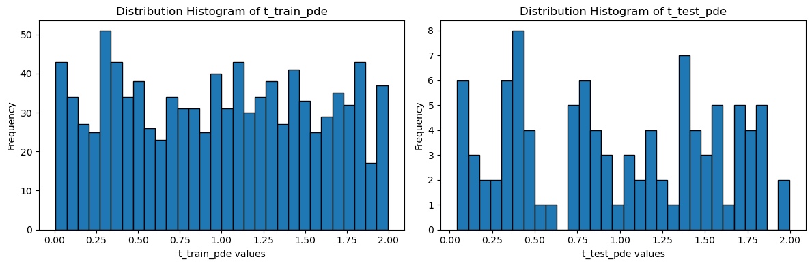
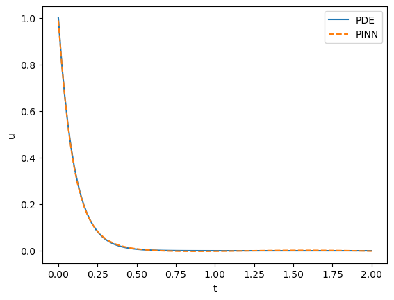
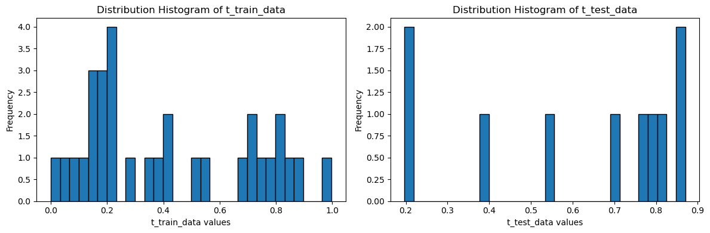
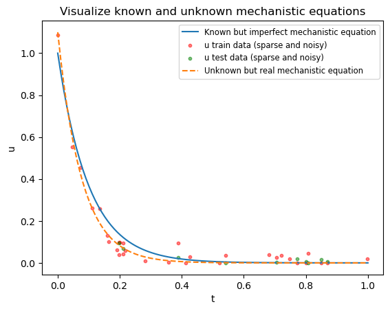
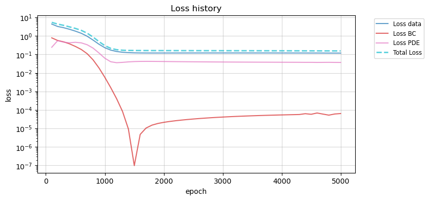
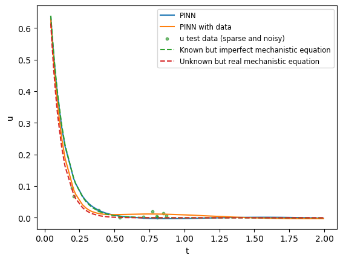
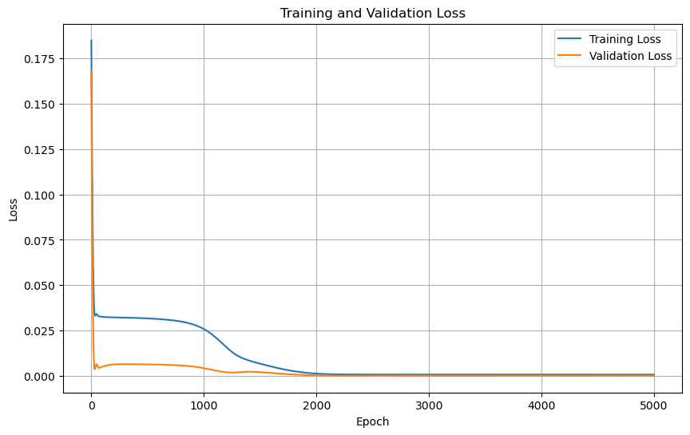
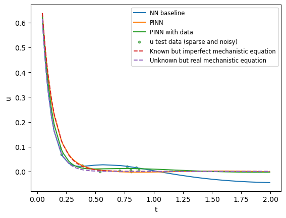

**Note:** All code is available in my Github repository called [Sandbox](https://github.com/ABrethome/Sandbox).
{: .notice}

In chemistry and in life sciences, there exists many use cases that would benefit from models incorporating both an imperfect mechanistic equation and real noisy sparse data.

This is what led a colleague to share a [click-bait article](https://arxiv.org/abs/2505.21723) about Physics-Informed Neural Networks compared to more traditional statistical approaches. This made me read more about the topic to a point where I started to wonder if such a tool was useful in my data-science-in-chemistry toolkit to help my fellow chemists for their specific use cases.

There are lots of papers out there selling PINNs as a game changer toolkit, where AI is described as having the capability of “[accelerating](https://www.youtube.com/watch?v=yxAJohm0l_g&ab_channel=TheRoyalSwedishAcademyofSciences)” or “[revolutionizing](https://www.youtube.com/watch?v=PKN95I93iGE&ab_channel=TheEconomist)” science as we know it. Even AI pioneer Yann LeCun [described it](https://x.com/ylecun/status/1581648953275473921) as a “pretty hot topic, indeed”. There are [lots of research](https://arxiv.org/html/2410.13228v1) trying to expand from PINNs.

So what are Physics-Informed Neural Networks (PINNs)?

Physics-Informed Neural Networks (PINNs) are a class of deep learning models that incorporate physical laws, typically expressed as partial differential equations (PDE), directly into the training process. Unlike traditional neural networks that rely solely on data, PINNs leverage both experimental data and known physical principles to guide learning, ensuring that predictions remain consistent with established scientific knowledge. 

Theoretically, such an approach is promising as it would allow PINNs to solve complex problems in science and engineering, such as modeling chemical reactions or simulating molecular dynamics, even when data is scarce or noisy. One could theoretically also [model the Shrodinger equation](https://arxiv.org/abs/2101.08593). By embedding mechanistic equations into the neural network’s loss function, PINNs have the potential to achieve more accurate and physically meaningful results compared to purely data-driven models.

This is particularly true in chemistry (or life science companies in general!), where it is not rare for data to be sparse or noisy, being because the test is expensive or imperfect or both. Thus, colleagues in research or manufacturing departments want to develop models that must be constrained by real-world physics, in particular when extrapolating from models.

Subject Matter Experts (SME) often come with very specific requests, with the desire to couple mechanistic models with a statistical/ML model with the hope to correct or enhance their mechanistic model.

There are lots of ways to incorporate mechanistic knowledge (perhaps for another blog post!), but here we are going to focus on PINNs.

## Introduction to PINNS in the context of a chemical reaction

I wanted to start my exploration with a (very) simple and directly relevant use case in chemistry.

Let's consider the textbook chemical reaction:

$$ \text{H}_2\text{O}_2 \rightarrow \text{H}_2\text{O} + \frac{1}{2}\text{O}_2 $$

This reaction is governed by the following first-order  kinetic rate law (here, my mechanistic model):

$$ \frac{d[\text{H}_2\text{O}_2]}{dt} = -k[\text{H}_2\text{O}_2] $$

This is an an ordinary differential equation (ODE).
The main difference between ODE and PDE is that an ODE involves derivatives with respect to a single variable (like time here), while a partial differential equation (PDE) involves derivatives with respect to multiple variables (such as time and space).
Here, I have the concentration of hydrogen peroxide, which depends on one variable which is time, describing how the concentration of $\text{H}_2\text{O}_2$ changes over time, and I want a model to be able to predict the concentration of $\text{H}_2\text{O}_2$ during a batch reaction (or whatever).

It can also be written like this:

$$ \frac{d[\text{H}_2\text{O}_2]}{dt} + k[\text{H}_2\text{O}_2] = 0 $$

### Let's use PINN to fit an equation (PDE or ODE)

We have the mechanistic equation describing our chemical system. Without having any data, the first thing one can do is _fit the ODE_ (or PDE).

Our equation is:
$$ \frac{du}{dt} + k u = 0 $$

where:
- $u$ is $[\text{H}_2\text{O}_2]$

Here, we know that the solution function to this ODE is:
$$u = A \exp{(-k t)}$$
where:
- $A$ represents the concentration of $[\text{H}_2\text{O}_2]$ at $t = 0$

We will use it to test predictions compared to the real analytical solution.

Now let's generate a mesh of datapoints, which will be used to train the neural network to fit the PDE:


```python
import tensorflow as tf
import numpy as np
import matplotlib.pyplot as plt
import keras
```


```python
num_domain = 1000
num_test = 100
minval_pde = 0
maxval_pde = 2
A = 1 # known initial condition given to the system - initial concentration
k = 10 # known textbook rate constant (here, made up)

def generate_uniform_data(num_domain, minval, maxval):
  data_init = tf.random_uniform_initializer(minval=minval, maxval=maxval, seed=0)
  return tf.Variable(data_init(shape=[num_domain, 1]), dtype=tf.float32)

t_train_pde = generate_uniform_data(num_domain, minval_pde, maxval_pde)
t_test_pde = generate_uniform_data(num_test, minval_pde, maxval_pde)
t_train_pde.shape, t_test_pde.shape
```


    (TensorShape([1000, 1]), TensorShape([100, 1]))


Here, we define a uniform mesh of $t \in [0, 2]$.
`t_train_pde` and `t_test_pde` represents the mesh we will use to train the neural network to fit the PDE.


```python
fig, axs = plt.subplots(1, 2, figsize=(12, 4))

axs[0].hist(t_train_pde.numpy().flatten(), bins=30, edgecolor='k')
axs[0].set_xlabel('t_train_pde values')
axs[0].set_ylabel('Frequency')
axs[0].set_title('Distribution Histogram of t_train_pde')

axs[1].hist(t_test_pde.numpy().flatten(), bins=30, edgecolor='k')
axs[1].set_xlabel('t_test_pde values')
axs[1].set_ylabel('Frequency')
axs[1].set_title('Distribution Histogram of t_test_pde')

plt.tight_layout()
plt.show()
```


    

    


We can then define our equations:
$$ \frac{du}{dt} + k u = 0 $$
$$ u(0) = A $$
$$u = A \exp{(-k t)}$$


```python
def jacobian(tape, u, t, i=0, j=0):
  if u.shape[1] > 1:
    u = u[:, i : i + 1]

  grads = tape.gradient(u, t)
  return grads[:, j : j + 1]
```


```python
def pde(tape, t, u):
  du_t = jacobian(tape, u, t)
  return du_t + k * u

def sol_pde(t):
  return A*tf.math.exp(-k*t)

def dirichlet_bc_0(t):
  return A

t_0 = tf.Variable([[0]], trainable=True, dtype=tf.float32)
```

Once this is defined, one can define the neural network as a simple sequantial architecture:


```python
n_inputs = 1
n_outputs = 1
hidden_units = [5, 5, 5]
activation = 'tanh'

pinn = tf.keras.models.Sequential()
pinn.add(tf.keras.layers.Input((n_inputs,)))

for units in hidden_units:
  pinn.add(tf.keras.layers.Dense(units=units, activation=activation))

pinn.add(tf.keras.layers.Dense(units=n_outputs))
pinn.summary()
```


<pre style="white-space:pre;overflow-x:auto;line-height:normal;font-family:Menlo,'DejaVu Sans Mono',consolas,'Courier New',monospace"><span style="font-weight: bold">Model: "sequential_2"</span>
</pre>


<pre style="white-space:pre;overflow-x:auto;line-height:normal;font-family:Menlo,'DejaVu Sans Mono',consolas,'Courier New',monospace">┏━━━━━━━━━━━━━━━━━━━━━━━━━━━━━━━━━┳━━━━━━━━━━━━━━━━━━━━━━━━┳━━━━━━━━━━━━━━━┓
┃<span style="font-weight: bold"> Layer (type)                    </span>┃<span style="font-weight: bold"> Output Shape           </span>┃<span style="font-weight: bold">       Param # </span>┃
┡━━━━━━━━━━━━━━━━━━━━━━━━━━━━━━━━━╇━━━━━━━━━━━━━━━━━━━━━━━━╇━━━━━━━━━━━━━━━┩
│ dense_8 (<span style="color: #0087ff; text-decoration-color: #0087ff">Dense</span>)                 │ (<span style="color: #00d7ff; text-decoration-color: #00d7ff">None</span>, <span style="color: #00af00; text-decoration-color: #00af00">5</span>)              │            <span style="color: #00af00; text-decoration-color: #00af00">10</span> │
├─────────────────────────────────┼────────────────────────┼───────────────┤
│ dense_9 (<span style="color: #0087ff; text-decoration-color: #0087ff">Dense</span>)                 │ (<span style="color: #00d7ff; text-decoration-color: #00d7ff">None</span>, <span style="color: #00af00; text-decoration-color: #00af00">5</span>)              │            <span style="color: #00af00; text-decoration-color: #00af00">30</span> │
├─────────────────────────────────┼────────────────────────┼───────────────┤
│ dense_10 (<span style="color: #0087ff; text-decoration-color: #0087ff">Dense</span>)                │ (<span style="color: #00d7ff; text-decoration-color: #00d7ff">None</span>, <span style="color: #00af00; text-decoration-color: #00af00">5</span>)              │            <span style="color: #00af00; text-decoration-color: #00af00">30</span> │
├─────────────────────────────────┼────────────────────────┼───────────────┤
│ dense_11 (<span style="color: #0087ff; text-decoration-color: #0087ff">Dense</span>)                │ (<span style="color: #00d7ff; text-decoration-color: #00d7ff">None</span>, <span style="color: #00af00; text-decoration-color: #00af00">1</span>)              │             <span style="color: #00af00; text-decoration-color: #00af00">6</span> │
└─────────────────────────────────┴────────────────────────┴───────────────┘
</pre>


<pre style="white-space:pre;overflow-x:auto;line-height:normal;font-family:Menlo,'DejaVu Sans Mono',consolas,'Courier New',monospace"><span style="font-weight: bold"> Total params: </span><span style="color: #00af00; text-decoration-color: #00af00">76</span> (304.00 B)
</pre>


<pre style="white-space:pre;overflow-x:auto;line-height:normal;font-family:Menlo,'DejaVu Sans Mono',consolas,'Courier New',monospace"><span style="font-weight: bold"> Trainable params: </span><span style="color: #00af00; text-decoration-color: #00af00">76</span> (304.00 B)
</pre>


<pre style="white-space:pre;overflow-x:auto;line-height:normal;font-family:Menlo,'DejaVu Sans Mono',consolas,'Courier New',monospace"><span style="font-weight: bold"> Non-trainable params: </span><span style="color: #00af00; text-decoration-color: #00af00">0</span> (0.00 B)
</pre>


To finally optimise our neural network:


```python
epochs = 2000
learning_rate = 0.005

optimizer = tf.keras.optimizers.Adam(learning_rate=learning_rate)

for i in range(epochs + 1):
  with tf.GradientTape() as tape_model:
    with tf.GradientTape(persistent=True) as tape_pde:
      u = pinn(t_train_pde, training=True)
      u_0 = pinn(t_0, training=True)[0][0]

    domain_error = pde(tape_pde, t_train_pde, u)
    bc1_error = u_0 - dirichlet_bc_0(t_0)

    domain_mse = tf.math.reduce_mean(tf.math.square(domain_error), axis=0)
    bc1_mse =  tf.math.square(bc1_error)
    total_mse = domain_mse + bc1_mse

  model_update_gradients = tape_model.gradient(total_mse, pinn.trainable_variables)
  optimizer.apply_gradients(
    zip(model_update_gradients, pinn.trainable_variables)
  )

  del tape_pde

  if i % 100 == 0:
    u_preds = pinn(t_test_pde)
    test_mse = tf.math.reduce_mean(tf.math.square(u_preds - sol_pde(t_test_pde)), axis=0)
    print('Epoch: {}\tTrain Loss = {},\tTest Loss = {}'.format(i, total_mse.numpy()[0], test_mse.numpy()[0]))
```

    Epoch: 0	Train Loss = 29.94611358642578,	Test Loss = 0.18610796332359314
    ...
    Epoch: 2000	Train Loss = 0.002519001718610525,	Test Loss = 5.647491889249068e-06
    

Thus, obtaining the following results:


```python
t_test_plot = np.linspace(minval_pde, maxval_pde, num_test)
u_pde_plot = sol_pde(t_test_plot)
u_pred_plot = pinn(t_test_plot)

plt.plot(t_test_plot, u_pde_plot)
plt.plot(t_test_plot, u_pred_plot, '--')
plt.legend(['PDE', 'PINN'])
plt.xlabel("t")
plt.ylabel("u")
plt.show()

```


    

    


We have successfully used a neural network to fit an ODE, and the same principle can be used for more advanced PDEs.

A lot of papers in the literature stop here: PINN in itself can theoretically have value if it allows to compute PDE solution faster than usual solvers. This can be particularly useful in graphic computation, for instance, and some papers report extremely high order of magnitudes faster computation time. That said, there is [a lot of criticisn around some reported applications](https://www.nature.com/articles/s42256-024-00897-5), as it is said a large number of papers take weak baselines to then claim their PINN is the best. In other words, it is easier to claim your method is the best if you are not comparing it to the other state-of-the-art approaches... This is quite a reccurrent issue in peer-reviewed papers, which can be covered in another post!

### Let's use PINN with experimental data

I don't need a PINN model to solve ODE/PDE, but rather I want to use it to balance mechanistic knowledge with real data.

However, I don't have experimental data, so I will synthesize noisy and sparse data for the purpose of this exploration.
For the data, I will assume I only managed to get some from $t \in [0, 1]$ and my old instrument can't measure lots of data points.
Note that I trained my model with the PDE mesh $t \in [0, 2]$, which means the PDE mesh allows me to train my model in a space where I do not have experimental data.


```python
num_train_data = 30
num_test_data = 10
minval_data = 0
maxval_data = 1

t_train_data = generate_uniform_data(num_train_data, minval_data, maxval_data)
# Add t = 0 to the beginning of t_train_data, this is known as it is the start of a reaction
t_train_data = tf.concat([tf.zeros((1, 1), dtype=t_train_data.dtype), t_train_data], axis=0)
t_test_data = generate_uniform_data(num_test_data, minval_data, maxval_data)
t_train_data.shape, t_test_data.shape
```


    (TensorShape([31, 1]), TensorShape([10, 1]))


```python
fig, axs = plt.subplots(1, 2, figsize=(12, 4))

axs[0].hist(t_train_data.numpy().flatten(), bins=30, edgecolor='k')
axs[0].set_xlabel('t_train_data values')
axs[0].set_ylabel('Frequency')
axs[0].set_title('Distribution Histogram of t_train_data')

axs[1].hist(t_test_data.numpy().flatten(), bins=30, edgecolor='k')
axs[1].set_xlabel('t_test_data values')
axs[1].set_ylabel('Frequency')
axs[1].set_title('Distribution Histogram of t_test_data')

plt.tight_layout()
plt.show()
```


    

    


There is no value of making a PINN if the PDE perfectly describes the chemical system (I would just use the PDE as my model!). Therefore, I will assume that some parameters used in the original equation were wrong, and that the real values are unknown and slightly different.

In our simple use case, one could assume that the textbook kinetic rate is slightly off, where $k_\text{real} = 13$ in reality, but textbook constant is $k_\text{textbook} = 10$. Similarly, one may have planned to add $1 mol/L$, whereas in reality $1.1 mol/L$ was added due to measurement errors.


```python
k_real = 13 # real, unknown rate constant because textbook info is not perfect
A_real = 1.1 # real, unknown initial condition because of measurement errors
```

We then create a function to conveniently generate datapoints, with noise or not.
Any negative concentration due to noise is set at 0, because negative concentration is impossible.


```python
def generate_u(t, noise = True):
  u = A_real*tf.math.exp(-k_real*t)
  if noise:
    noise = tf.random.normal(shape=tf.shape(u), mean=0.0, stddev=0.03, dtype=u.dtype)
    u = u + noise
  u = tf.where(u < 0, tf.zeros_like(u), u)
  return u
```

Let's generate our noisy and sparse data:


```python
u_train_data = generate_u(t_train_data)
u_test_data = generate_u(t_test_data)
```

Let's visualize our newly created data:


```python
t_test_plot = np.linspace(0, 1, 100)
u_mech_plot = sol_pde(t_test_plot)

plt.plot(t_test_plot, u_mech_plot, label="Known but imperfect mechanistic equation")

plt.scatter(t_train_data.numpy().flatten(), u_train_data.numpy().flatten(), color='red', label='u train data (sparse and noisy)', s=10, alpha=0.5)
plt.scatter(t_test_data.numpy().flatten(), u_test_data.numpy().flatten(), color='green', label='u test data (sparse and noisy)', s=10, alpha=0.5)

plt.plot(t_test_plot, generate_u(t_test_plot, noise = False), "--", label="Unknown but real mechanistic equation", )

plt.title('Visualize known and unknown mechanistic equations')
plt.xlabel("t")
plt.ylabel("u")
plt.legend(loc='upper right', fontsize='small')
plt.show()
```


    

    


Let's make a new model to take into account the data loss:


```python
n_inputs = 1
n_outputs = 1
hidden_units = [5, 5, 5]
activation = 'tanh'
last_ep = 0

pinn_with_data = tf.keras.models.Sequential()
pinn_with_data.add(tf.keras.layers.Input((n_inputs,)))

for units in hidden_units:
  pinn_with_data.add(tf.keras.layers.Dense(units=units, activation=activation))

pinn_with_data.add(tf.keras.layers.Dense(units=n_outputs))
pinn_with_data.summary()
```


<pre style="white-space:pre;overflow-x:auto;line-height:normal;font-family:Menlo,'DejaVu Sans Mono',consolas,'Courier New',monospace"><span style="font-weight: bold">Model: "sequential_3"</span>
</pre>


<pre style="white-space:pre;overflow-x:auto;line-height:normal;font-family:Menlo,'DejaVu Sans Mono',consolas,'Courier New',monospace">┏━━━━━━━━━━━━━━━━━━━━━━━━━━━━━━━━━┳━━━━━━━━━━━━━━━━━━━━━━━━┳━━━━━━━━━━━━━━━┓
┃<span style="font-weight: bold"> Layer (type)                    </span>┃<span style="font-weight: bold"> Output Shape           </span>┃<span style="font-weight: bold">       Param # </span>┃
┡━━━━━━━━━━━━━━━━━━━━━━━━━━━━━━━━━╇━━━━━━━━━━━━━━━━━━━━━━━━╇━━━━━━━━━━━━━━━┩
│ dense_12 (<span style="color: #0087ff; text-decoration-color: #0087ff">Dense</span>)                │ (<span style="color: #00d7ff; text-decoration-color: #00d7ff">None</span>, <span style="color: #00af00; text-decoration-color: #00af00">5</span>)              │            <span style="color: #00af00; text-decoration-color: #00af00">10</span> │
├─────────────────────────────────┼────────────────────────┼───────────────┤
│ dense_13 (<span style="color: #0087ff; text-decoration-color: #0087ff">Dense</span>)                │ (<span style="color: #00d7ff; text-decoration-color: #00d7ff">None</span>, <span style="color: #00af00; text-decoration-color: #00af00">5</span>)              │            <span style="color: #00af00; text-decoration-color: #00af00">30</span> │
├─────────────────────────────────┼────────────────────────┼───────────────┤
│ dense_14 (<span style="color: #0087ff; text-decoration-color: #0087ff">Dense</span>)                │ (<span style="color: #00d7ff; text-decoration-color: #00d7ff">None</span>, <span style="color: #00af00; text-decoration-color: #00af00">5</span>)              │            <span style="color: #00af00; text-decoration-color: #00af00">30</span> │
├─────────────────────────────────┼────────────────────────┼───────────────┤
│ dense_15 (<span style="color: #0087ff; text-decoration-color: #0087ff">Dense</span>)                │ (<span style="color: #00d7ff; text-decoration-color: #00d7ff">None</span>, <span style="color: #00af00; text-decoration-color: #00af00">1</span>)              │             <span style="color: #00af00; text-decoration-color: #00af00">6</span> │
└─────────────────────────────────┴────────────────────────┴───────────────┘
</pre>


<pre style="white-space:pre;overflow-x:auto;line-height:normal;font-family:Menlo,'DejaVu Sans Mono',consolas,'Courier New',monospace"><span style="font-weight: bold"> Total params: </span><span style="color: #00af00; text-decoration-color: #00af00">76</span> (304.00 B)
</pre>


<pre style="white-space:pre;overflow-x:auto;line-height:normal;font-family:Menlo,'DejaVu Sans Mono',consolas,'Courier New',monospace"><span style="font-weight: bold"> Trainable params: </span><span style="color: #00af00; text-decoration-color: #00af00">76</span> (304.00 B)
</pre>


<pre style="white-space:pre;overflow-x:auto;line-height:normal;font-family:Menlo,'DejaVu Sans Mono',consolas,'Courier New',monospace"><span style="font-weight: bold"> Non-trainable params: </span><span style="color: #00af00; text-decoration-color: #00af00">0</span> (0.00 B)
</pre>


And we can train the newly made model by adding the data loss, and some weights. Here, we significantly overweight the data loss because we want the neural network to prefer the data when there is some:


```python
epochs = int(5e3)
learning_rate = 0.005

# weight of losses 
w_d = 100. # weight for data loss
w_b = 1. # weight for boundary condition loss
w_r = 1. # weight for residual PDE loss

optimizer = tf.keras.optimizers.Adam(learning_rate=learning_rate)

if last_ep == 0:
  ep_log = []
  loss_log = []
  loss_log_d = []
  loss_log_b = []
  loss_log_r = []

for i in range(epochs + 1):
  # to handle restarts
  if i <= last_ep:
    continue

  with tf.GradientTape() as tape_model:
    u = pinn_with_data(t_train_data, training=True)
    data_error = u - u_train_data

    with tf.GradientTape(persistent=True) as tape_pde:
      u = pinn_with_data(t_train_pde, training=True)
      u_0 = pinn_with_data(t_0, training=True)[0][0]

      domain_error = pde(tape_pde, t_train_pde, u)
      bc1_error = u_0 - dirichlet_bc_0(t_0)

    domain_mse = w_r * tf.math.reduce_mean(tf.math.square(domain_error), axis=0)
    bc1_mse =  w_b * tf.math.square(bc1_error)
    data_mse = w_d * tf.math.reduce_mean(tf.math.square(data_error), axis=0)
    total_mse = domain_mse + bc1_mse + data_mse

  model_update_gradients = tape_model.gradient(total_mse, pinn_with_data.trainable_variables)
  optimizer.apply_gradients(
    zip(model_update_gradients, pinn_with_data.trainable_variables)
  )

  del tape_pde
  last_ep = i

  if i % 100 == 0:
    ep_log.append(i)
    loss_log.append(total_mse.numpy()[0])
    loss_log_d.append(data_mse.numpy())
    loss_log_b.append(bc1_mse.numpy())
    loss_log_r.append(domain_mse.numpy()[0])

    u_preds_data = pinn_with_data(t_test_data)
    # when there is data, one will use data to compute validation loss with MSE
    test_mse = tf.math.reduce_mean(tf.math.square(u_preds_data - u_test_data), axis=0)
    print('Epoch: {}\tTrain Loss = {},\tTest Loss = {}'.format(i, total_mse.numpy()[0], test_mse.numpy()[0]))
```

    WARNING:tensorflow:Calling GradientTape.gradient on a persistent tape inside its context is significantly less efficient than calling it outside the context (it causes the gradient ops to be recorded on the tape, leading to increased CPU and memory usage). Only call GradientTape.gradient inside the context if you actually want to trace the gradient in order to compute higher order derivatives.
    Epoch: 100	Train Loss = 5.403824329376221,	Test Loss = 0.0015255033504217863
    ...
    Epoch: 4900	Train Loss = 0.15517958998680115,	Test Loss = 9.75308648776263e-05
    Epoch: 5000	Train Loss = 0.1549045741558075,	Test Loss = 9.673461318016052e-05
    

To better understand what happens, let's plot each loss separately:


```python
plt.figure(figsize=(8, 4))
colors = plt.get_cmap('tab10', 4)
plt.plot(ep_log, loss_log_d, alpha=.7, color=colors(0), label="Loss data" )
plt.plot(ep_log, loss_log_b, alpha=.7, color=colors(1), label="Loss BC")
plt.plot(ep_log, loss_log_r, alpha=.7, color=colors(2), label="Loss PDE")
plt.plot(ep_log, loss_log, '--', lw=2, alpha=.7, color=colors(3), label="Total Loss")
plt.xlabel("epoch")
plt.ylabel("loss")
plt.yscale("log")
plt.title("Loss history")
plt.legend(bbox_to_anchor=(1.05, 1), loc='upper left', fontsize='small')
plt.grid(alpha=.5)
plt.show()
```


    

    


We can then visualize the result:


```python
t_test_plot = t_test_pde.numpy().flatten()
sorted_indices_for_pde = np.argsort(t_test_plot)
t_test_plot = t_test_plot[sorted_indices_for_pde]

t_test_data_plot = t_test_data.numpy().flatten()
sorted_indices_for_data = np.argsort(t_test_data_plot)
t_test_data_sorted = t_test_data_plot[sorted_indices_for_data]
u_test_data_sorted = u_test_data.numpy().flatten()[sorted_indices_for_data]

u_pred_plot = pinn(t_test_plot)
u_pred_with_data_plot = pinn_with_data(t_test_plot)


plt.plot(t_test_plot, u_pred_plot, label="PINN")
plt.plot(t_test_plot, u_pred_with_data_plot, label="PINN with data")
plt.scatter(t_test_data_sorted, u_test_data_sorted, color='green', label='u test data (sparse and noisy)', s=10, alpha=0.5)
plt.plot(t_test_plot, sol_pde(t_test_plot), "--", label="Known but imperfect mechanistic equation", )
plt.plot(t_test_plot, generate_u(t_test_plot, noise = False), "--", label="Unknown but real mechanistic equation", )
plt.xlabel("t")
plt.ylabel("u")
plt.legend(loc='upper right', fontsize='small')
plt.show()

```


    

    


One can see that the PINN model with data overfits the data (because of the weight we have put), but at the same time is capable of getting closer to the unknown mechanistic equation.
As desired, it finds a compromise between both as dictated by the different loss weights.

Alright, we successfully created a PINN model with data on a very simple use case.

But is it actually useful?

### Let's create a classic Neural Network to compare

As our baseline, we are going to compare the same neural network architecture, which solely uses the data loss (MSE).


```python
# re-use eaxctly the same hyper parameters again
n_inputs = 1
n_outputs = 1
hidden_units = [5, 5, 5]
activation = 'tanh'
last_ep = 0

nn_with_data = tf.keras.models.Sequential()
nn_with_data.add(tf.keras.layers.Input((n_inputs,)))

for units in hidden_units:
  nn_with_data.add(tf.keras.layers.Dense(units=units, activation=activation))

nn_with_data.add(tf.keras.layers.Dense(units=n_outputs))
nn_with_data.summary()
```


<pre style="white-space:pre;overflow-x:auto;line-height:normal;font-family:Menlo,'DejaVu Sans Mono',consolas,'Courier New',monospace"><span style="font-weight: bold">Model: "sequential_4"</span>
</pre>


<pre style="white-space:pre;overflow-x:auto;line-height:normal;font-family:Menlo,'DejaVu Sans Mono',consolas,'Courier New',monospace">┏━━━━━━━━━━━━━━━━━━━━━━━━━━━━━━━━━┳━━━━━━━━━━━━━━━━━━━━━━━━┳━━━━━━━━━━━━━━━┓
┃<span style="font-weight: bold"> Layer (type)                    </span>┃<span style="font-weight: bold"> Output Shape           </span>┃<span style="font-weight: bold">       Param # </span>┃
┡━━━━━━━━━━━━━━━━━━━━━━━━━━━━━━━━━╇━━━━━━━━━━━━━━━━━━━━━━━━╇━━━━━━━━━━━━━━━┩
│ dense_16 (<span style="color: #0087ff; text-decoration-color: #0087ff">Dense</span>)                │ (<span style="color: #00d7ff; text-decoration-color: #00d7ff">None</span>, <span style="color: #00af00; text-decoration-color: #00af00">5</span>)              │            <span style="color: #00af00; text-decoration-color: #00af00">10</span> │
├─────────────────────────────────┼────────────────────────┼───────────────┤
│ dense_17 (<span style="color: #0087ff; text-decoration-color: #0087ff">Dense</span>)                │ (<span style="color: #00d7ff; text-decoration-color: #00d7ff">None</span>, <span style="color: #00af00; text-decoration-color: #00af00">5</span>)              │            <span style="color: #00af00; text-decoration-color: #00af00">30</span> │
├─────────────────────────────────┼────────────────────────┼───────────────┤
│ dense_18 (<span style="color: #0087ff; text-decoration-color: #0087ff">Dense</span>)                │ (<span style="color: #00d7ff; text-decoration-color: #00d7ff">None</span>, <span style="color: #00af00; text-decoration-color: #00af00">5</span>)              │            <span style="color: #00af00; text-decoration-color: #00af00">30</span> │
├─────────────────────────────────┼────────────────────────┼───────────────┤
│ dense_19 (<span style="color: #0087ff; text-decoration-color: #0087ff">Dense</span>)                │ (<span style="color: #00d7ff; text-decoration-color: #00d7ff">None</span>, <span style="color: #00af00; text-decoration-color: #00af00">1</span>)              │             <span style="color: #00af00; text-decoration-color: #00af00">6</span> │
└─────────────────────────────────┴────────────────────────┴───────────────┘
</pre>


<pre style="white-space:pre;overflow-x:auto;line-height:normal;font-family:Menlo,'DejaVu Sans Mono',consolas,'Courier New',monospace"><span style="font-weight: bold"> Total params: </span><span style="color: #00af00; text-decoration-color: #00af00">76</span> (304.00 B)
</pre>


<pre style="white-space:pre;overflow-x:auto;line-height:normal;font-family:Menlo,'DejaVu Sans Mono',consolas,'Courier New',monospace"><span style="font-weight: bold"> Trainable params: </span><span style="color: #00af00; text-decoration-color: #00af00">76</span> (304.00 B)
</pre>


<pre style="white-space:pre;overflow-x:auto;line-height:normal;font-family:Menlo,'DejaVu Sans Mono',consolas,'Courier New',monospace"><span style="font-weight: bold"> Non-trainable params: </span><span style="color: #00af00; text-decoration-color: #00af00">0</span> (0.00 B)
</pre>


Because there is nothing fancy here, we can leverage the keras compiler out-of-the-box:


```python
epochs = int(5e3)
learning_rate = 0.005

optimizer = tf.keras.optimizers.Adam(learning_rate=learning_rate)

loss_mse = keras.losses.MeanSquaredError()

nn_with_data.compile(
    optimizer='adam',
    loss=loss_mse,
    metrics=[keras.metrics.MeanSquaredError()],
)
```

Let's train the model:


```python
history = nn_with_data.fit(
    t_train_data, 
    u_train_data, 
    epochs=epochs, 
    batch_size=64,
    shuffle=True,
    validation_data=(t_test_data, u_test_data), 
    verbose=1
)
```

    Epoch 1/5000
    ...
    Epoch 5000/5000
    


```python
plt.figure(figsize=(10, 6))
plt.plot(history.history['loss'], label='Training Loss')
plt.plot(history.history['val_loss'], label='Validation Loss')
plt.xlabel('Epoch')
plt.ylabel('Loss')
plt.title('Training and Validation Loss')
plt.legend()
plt.grid(True)
plt.show()
```


    

    


Let's compare the baseline with the previous models:


```python
t_test_plot = t_test_pde.numpy().flatten()
sorted_indices_for_pde = np.argsort(t_test_plot)
t_test_plot = t_test_plot[sorted_indices_for_pde]

t_test_data_plot = t_test_data.numpy().flatten()
sorted_indices_for_data = np.argsort(t_test_data_plot)
t_test_data_sorted = t_test_data_plot[sorted_indices_for_data]
u_test_data_sorted = u_test_data.numpy().flatten()[sorted_indices_for_data]

u_pred_baseline = nn_with_data(t_test_plot)
u_pred_plot = pinn(t_test_plot)
u_pred_with_data_plot = pinn_with_data(t_test_plot)

plt.plot(t_test_plot, u_pred_baseline, label="NN baseline")
plt.plot(t_test_plot, u_pred_plot, label="PINN")
plt.plot(t_test_plot, u_pred_with_data_plot, label="PINN with data")
plt.scatter(t_test_data_sorted, u_test_data_sorted, color='green', label='u test data (sparse and noisy)', s=10, alpha=0.5)
plt.plot(t_test_plot, sol_pde(t_test_plot), "--", label="Known but imperfect mechanistic equation", )
plt.plot(t_test_plot, generate_u(t_test_plot, noise = False), "--", label="Unknown but real mechanistic equation", )
plt.xlabel("t")
plt.ylabel("u")
plt.legend(loc='upper right', fontsize='small')
plt.show()

```


    

    


If you remember, we have the PDE mesh $t \in [0, 2]$ whereas we only collected data where $t \in [0, 1]$. Thus, the baseline neural network is only trained on $t \in [0, 1]$. The baseline intrapolation therefore is where $t \in [0, 1]$ and anything outside this range is extrapolation. Unfortunately, the baseline model extrapolates negative concentrations, because there has been no physical constraints.

On the contrary, the PINN with data model is capable of fitting the data in the region where it is available, and at the same can extrapolate thanks to the mesh provided to generate data artificially using the PDE. The PINN with data is literally a compromise between both the data and the mechanistic equation.

## Conclusion

It is important to note that the example presented here is intentionally simple. Through this exploration of PINNs, several key observations emerged:

**Challenges and considerations with PINNs:**
- The convergence of PINNs is influenced by numerous factors, including the choice of initializer, optimizer, and mesh. It is common for training to become trapped in local minima or converge to trivial solutions, especially when working with noisy experimental data.
- Careful definition of the mechanistic model is essential. For example, if $u$ represents concentration, a constant solution such as $u(t) = 0$ may minimize the ODE residual but is not informative. Initial and boundary conditions play a critical role in guiding the neural network toward meaningful, non-trivial solutions.
- The initial condition loss is designed to prevent convergence to trivial solutions (e.g., $u(t) = 0$). However, in practice, the ODE loss may favor trivial solutions, while the initial condition loss encourages non-trivial ones. The relative weighting of these losses can therefore be significant.
- The magnitudes of different loss components can vary substantially during training, making it challenging to select appropriate weights. For instance, the initial condition loss may dominate early in training, while the PDE loss can become more significant later.
- In applications involving experimental data, model validation is typically performed using real data and data loss metrics. Validating against synthetic data generated from the mechanistic model primarily assesses the model’s ability to fit the theoretical equation, which may not reflect real-world performance. As a result, increasing the weight of the data loss often improves validation metrics, regardless of the quality of the mechanistic model.

**Reflections on the usefulness of PINNs in chemistry:**
- Theoretical and computational chemistry is likely to leverage such a method, for force fields for instance ([here](https://www.arxiv.org/abs/2504.16381) and [here](https://arxiv.org/abs/2404.13368)). It is straightforward to see the advantage of such a methodology in a field known to be limited by the computational cost of modelling large molecules such as polymers or proteins.
- I see usage in experimental chemistry to be mixed:
    - When an imperfect mechanistic model and experimental data are both available, PINNs can, in principle, leverage both sources of information. However, in practice, the data loss often takes precedence, especially when the mechanistic model is known to be imperfect. If the data loss is heavily weighted relative to the physics loss, the model may perform similarly to a standard neural network regression, except in cases where extrapolation is required (such as the provided example).
    - If a robust mechanistic model exists and data are sparse, PINNs may again be considered. However, if the mechanistic model already provides a good fit to the available data, the added value of a PINN may be limited.
    - In scenarios where both the mechanistic model is simplistic and the data are sparse and noisy, PINNs are unlikely to yield significant improvements. Model performance will remain limited until either the mechanistic understanding improves or more data become available.

In my view, PINNs can be valuable in specific contexts, but they are not universally transformative. As with any method, understanding the appropriate context for their application is crucial; they should be viewed as complementary tools rather than replacements for established approaches such as statistical modeling (e.g. Bayesian).

Any paper claiming otherwise is likely facing some form of [biases](https://www.understandingai.org/p/i-got-fooled-by-ai-for-science-hypeheres?r=2zm2nw&utm_campaign=post&utm_medium=email&triedRedirect=true).
